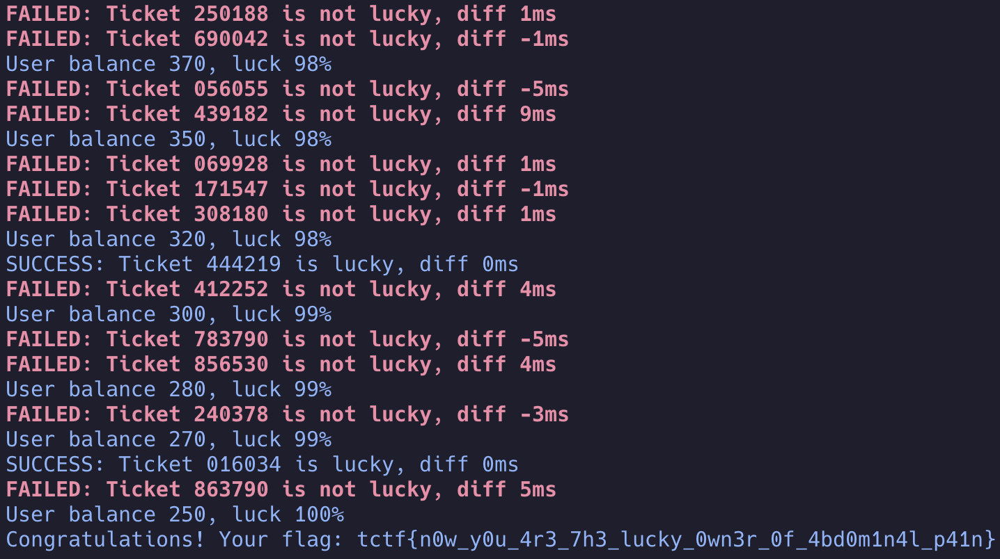

# Lucky ticket | Tinkoff CTF 2024

Бессмысленное самостоятельное решение задачи ["Счастливый билетик"](https://spbctf.notion.site/f20797565c704e1a9038e890862c0bef) на Java
перед [Tinkoff CTF 2024](https://ctf.tinkoff.ru/).



# Решение

Основная проблема того, чтобы написать решение задачи на Java в этом участке кода сервера:

```go
func GenerateTicketNumber() string {
	source := rand.NewSource(time.Now().UnixNano() / int64(time.Millisecond))
	random := rand.New(source)

	return fmt.Sprintf("%06d", random.Intn(1000000))
}
```

, где для генерации номера билета используется функция [Intn](https://pkg.go.dev/math/rand#Intn) из пакета math/rand. Поэтому на этом этапе
можно уже остановиться.

В любом случае решение возможно, если скомпилировать код на Go в динамически подключаемую библиотеку (.so, .dylib, .dll). А далее мы уже
можем использовать JNI для подключения этой библитеки.

Пишем код генератора на Go:

```go
package main

import (
    "math/rand"
    "C"
)

//export Random
func Random(n int, seed int64) int {
	source := rand.NewSource(seed)
    random := rand.New(source)

	return random.Intn(n)
}

func main() {} // Required but ignored
```

Тут важно использовать `//export` для анотирования функций, которые мы хотим сделать доступными. И нужно добавить пакет "C", он нам как раз
необходим для создания динамической библиотеки.

Теперь, что собрать библиотеку, нам нужно использовать флаг `-buildmode=c-shared`. Пример:

```shell
go build -o librandom.so -buildmode=c-shared random.go
```

Далее уже подключаем нашу библиотеку через JNI например [так](src/main/java/wtf/popov/ctf/luckyticket/random/GoRandom.java).

Для JNI нужно описать интерфейс с нашей новой функцией:

```java
public interface NativeRandom extends Library {

    int Random(int n, long seed);

}
```

Тут не забываем про ```extends Library``` и далее уже мапим наш интерфейс с нашей либой:

```java
static NativeRandom GO_RANDOM = Native.load(NativeRandom.class);
```

Важно подгрузить нашу библиотеку до этого вызова.

И теперь мы можем писать наш код на Java с испольованием rand из Go.

# Как собрать и запустить

## Собираем через Maven:

```shell
mvn package
```

## И запускаем:

```shell
java -jar target/luckyticket.jar https://t-luckyticket-w8mg6qr0.spbctf.ru ${username} ${password}
```

## Если вы фанат GraalVM (я нет):

```shell
mvn -Pnative package
```

## Запуск:

```shell
./target/luckyticket https://t-luckyticket-w8mg6qr0.spbctf.ru ${username} ${password}
```

## Если не хватает библиотек под вашу систему:


```shell
mvn -Pbinaries package
```

Но нужен сам Go и make, и не факт, что это заработает.
[Здесь](https://github.com/scijava/native-lib-loader?tab=readme-ov-file#package-native-libraries) описание того, как должны лежать бинари.

# Вывод

Лучше просто написать на Go.